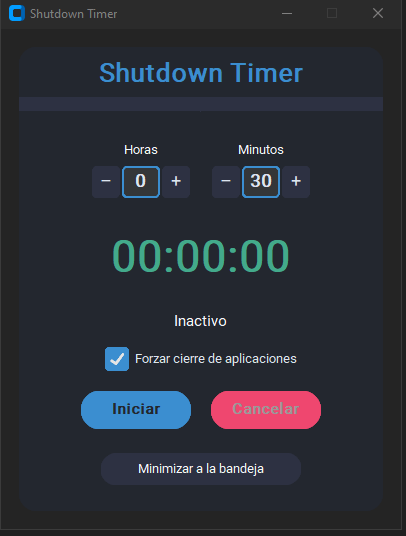

# Shutdown Timer

Shutdown Timer es una aplicación de escritorio minimalista y elegante para programar el apagado automático de tu PC, desarrollada en Python con CustomTkinter.

## Capturas

Aplicacion
---


Icono
---


---

## Estructura del proyecto

```
shutdown_timer/
├── main.py
├── gui/
│   └── app.py
├── logic/
│   └── timer.py
├── system/
│   └── shutdown.py
├── tray/
│   └── trayicon.py
├── assets/
│   └── shutdown_timer.ico
```

---

## Requisitos

- Python 3.8 o superior
- [CustomTkinter](https://github.com/TomSchimansky/CustomTkinter)
- pystray
- pillow
- pyinstaller (solo para crear el ejecutable)

Instala las dependencias con:

```sh
pip install customtkinter pystray pillow pyinstaller
```

---

## Ejecución en modo desarrollo

```sh
python main.py
```

---

## Crear el ejecutable en Windows (con ícono personalizado)

1. Abre una terminal (CMD, PowerShell o Git Bash) en la carpeta raíz del proyecto.
2. Ejecuta:

```sh
pyinstaller --noconfirm --onefile --windowed --icon=assets/shutdown_timer.ico main.py
```

- El ejecutable se generará en la carpeta `dist/` como `main.exe`.
- Si quieres que el ejecutable se llame `ShutdownTimer.exe`, agrega `--name ShutdownTimer` al comando:

```sh
pyinstaller --noconfirm --onefile --windowed --icon=assets/shutdown_timer.ico --name ShutdownTimer main.py
```

---

## Notas

- El ícono de la ventana y el de la bandeja pueden diferir según el sistema operativo.
- Si usas el ejecutable, asegúrate de que el archivo `.ico` esté en la ruta correcta o embebido.
- Puedes mover la ventana arrastrando cualquier parte de la interfaz.
