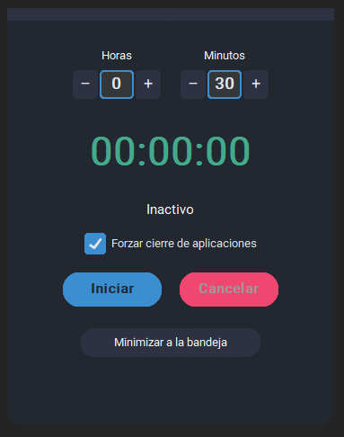

# Shutdown Timer

Temporizador de apagado de mi computadora, aveces me quedo dormido con una peli y mi pc consume mucha energia por lo que se me le ocurruio un temporizador para mi uso personal igual que el de la tv cuando era chikitin.

## Capturas

Aplicacion
---


Icono
---


## Requerimientos

```
pip install customtkinter pystray pillow
```

## Ejecutable para Windows

```bash
pyinstaller --noconfirm --onefile --windowed --icon=icon.ico shutdown_timer.py
```